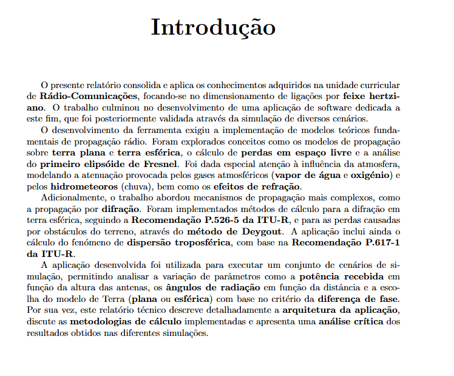

### 28-10-2025. 15:30 - 17:00 (Francisco Lopes) 54 dias deadline

## O QUE SE PROPÔS A FAZER:
    - 1, 2, 3 e 4 (Parte 1 - Desenvolvimento da aplicação)
    
## O QUE FOI FEITO:
    - 1, 2, 3 e 4 (Parte 1 - Desenvolvimento da aplicação)
## O QUE FALTA:
    - Comentários
    - PENSAR COMO JUNTAR TUDO FIZ SEPARADO @Dragovic @Galveia

## COMENTÁRIO:
Como decidido pelo grupo foi escolhida a linguagem MATLAB para criar a aplicação pedida pelo enunciado

### 29-10-2025. 13:40 - 15:20 (Francisco Lopes) 53 dias deadline

## O QUE SE PROPÔS A FAZER:
    - Juntar o 1,2,3,4 (Parte 1 - Desenvolvimento da aplicação)
    - 5, 6, 7, 8, 9, 10, 11, 12, 13, 14, 15, 16 (Parte 1 - Desenvolvimento da aplicação)
## O QUE FOI FEITO:
    - Juntar o 1,2,3,4 (Parte 1 - Desenvolvimento da aplicação)
    - 5, 6, 7, 8, 9, 10, 11, 12, 13, 14, 15, 16 (Parte 1 - Desenvolvimento da aplicação)
## O QUE FALTA:
    - Comentários
    - Verificar de novo os exercicios e corrigir
## COMENTARIO:
- Consegui juntar todos os exercicios até ao 16 main.m, a aplicação em si ainda nao esta feita.

### 01-11-2025. 11:40 - 13:00 (João Galveia) 50 dias deadline

## O QUE SE PROPÔS A FAZER:
    - Testar fórmulas do exercício 9
## O QUE FOI FEITO:
    - Testar fórmulas do exercício 9
## O QUE FALTA:
    - Tirar conclusões
## COMENTARIO:
    - Os valores estão estranhos, tenho que perguntar ao stor sobre as fórmulas
    - Se aumentar a distância, a atenuação quase não altera 

### 04-11-2025. 14:00 - 14:40 (Francisco Lopes) 47 dias deadline

## O QUE SE PROPÔS A FAZER:
    - Introdução
## O QUE FOI FEITO:
    - Introdução

## COMENTARIO:
    - Rever de novo o português

    

    
### 11-11-2025. 14:00 - 15:16 (Joao Dragovic) 40 dias deadline

## O QUE SE PROPÔS A FAZER:
    - Fazer 8 da Parte 2
## O QUE FOI FEITO:
    - Exercicio 8 da Parte 2 (Gráficos inclusive)

## COMENTARIO:
    - PReciso de verificar com o professor se parecem bem

    
### 11-11-2025. 15:40 - 18:40 (João Galveia) 40 dias deadline

## O QUE SE PROPÔS A FAZER:
    - Fazer exercício 9
## O QUE FOI FEITO:
    - Exercício 9
## COMENTARIO:
    - Já tirei as conclusões. Agora é ver se estão bem e por no relatório

### 12-11-2025. 14:00 - 16:34 (Joao Dragovic) 39 dias deadline

## O QUE SE PROPÔS A FAZER:
    - Certificar que o 8 da parte 2 está correto.
## O QUE FOI FEITO:
    - Corrigir o 8 e confirmar os valores com o professor

## COMENTARIO:
    -  o gráfico talvez precise de um toque 
    